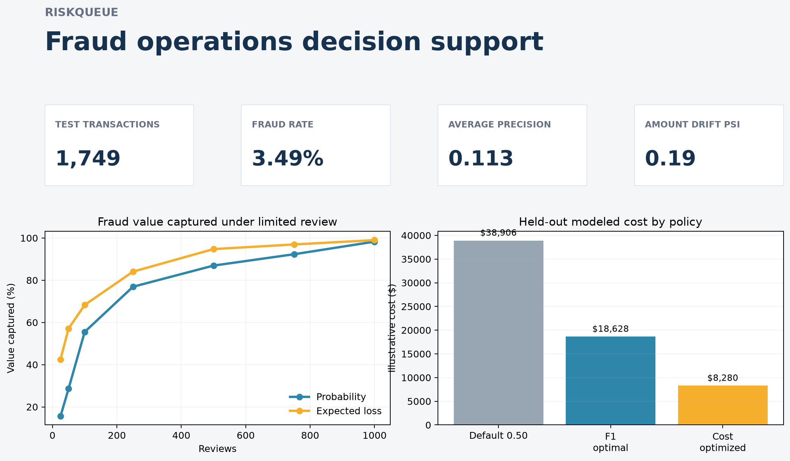
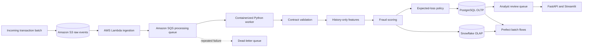

# RiskQueue

### Event-driven fraud decisioning under constrained analyst capacity

RiskQueue is a cloud-ready transaction risk and fraud-operations system. It preserves raw events, validates and enriches transactions, scores fraud risk, ranks cases by expected financial loss, records operational state, and publishes analytical history without making synchronous application requests depend on a warehouse.

The application combines **AWS S3, Lambda, SQS, a containerized Python worker, PostgreSQL, Snowflake, Prefect, FastAPI, Streamlit, Terraform, scikit-learn, and XGBoost-ready modeling**.

**[Open the interactive RiskQueue workspace](https://cr-shah.github.io/riskqueue/)** — responsive capacity planning, scenario comparison, a filterable review queue, case explanations, calibrated model diagnostics, and reproducible CSV/JSON exports. This public GitHub Pages site uses a historical synthetic snapshot. The authenticated operational interface is served separately by FastAPI at `/operator` when an API and database are deployed.

The website uses dependency-free JavaScript, semantic HTML, CSS, and interactive SVG charts, with a Python snapshot builder and GitHub Actions deployment. See [website architecture, testing, and publishing](docs/WEBSITE.md).



> [!IMPORTANT]
> The checked-in metrics are reproducible results from a deterministic synthetic demo. They are not PaySim results and do not establish performance for a real financial institution.

| Rare-event ranking | Operational outcome at 750 reviews | Decision policy |
|---|---|---|
| **0.113 average precision** | **96.9% fraud value captured** with expected-loss ranking | **$8,280 modeled cost** at the validation-selected cost threshold |
| 3.49% demo fraud rate | vs. 92.3% using probability alone | vs. $38,906 at threshold 0.50 |

## Problem

Fraud operations face two simultaneous constraints: transactions have unequal financial exposure, and analysts can investigate only a limited number of alerts. A useful system must do more than classify transactions. It must preserve source evidence, process events reliably, prevent duplicate financial records, expose current analyst state quickly, and retain analytical history for monitoring and policy evaluation.

RiskQueue separates these concerns:

- The model estimates fraud probability.
- The decision layer computes expected loss and review value.
- PostgreSQL serves operational application state.
- Snowflake stores analytical history outside the request path.
- SQS absorbs bursts and provides retry isolation.
- A dead-letter queue retains repeatedly failing messages.
- Prefect runs scheduled analytical workflows rather than event-level processing.

## Verified demo results

| Evaluation | Result |
|---|---:|
| Held-out synthetic transactions | **1,749** |
| Fraud rate | **3.49%** |
| Expected-loss value capture at 750 reviews | **96.9%** |
| Probability-only value capture at 750 reviews | **92.3%** |
| Expected-loss improvement | **4.6 percentage points** |
| Amount drift PSI in shifted demo | **0.19 — watch** |
| Local in-process batch API p95 at 1,000 | **10.90 ms** |

Expected-loss ranking also captures 68.3% of fraud value in 100 reviews and 94.7% in 500 reviews. These values come from the checked-in generated artifacts and are not cloud throughput claims.

## Architecture



## Event flow

### 1. Raw landing in S3

Transaction batches land under the S3 `incoming/` prefix. Bucket versioning, server-side encryption, and public-access blocking are provisioned by Terraform. The storage adapter attaches ingestion timestamp and source metadata and uses conditional writes for immutable ingestion.

`LocalObjectStore` provides the same byte-oriented interface for local development and unit tests. Local writes use exclusive file creation and persist a metadata sidecar.

### 2. Lightweight Lambda ingestion

S3 object creation invokes a small Lambda handler. The function:

1. validates the S3 event or supported request envelope;
2. URL-decodes the object reference;
3. creates a versioned processing message;
4. derives a deterministic event identifier when one is not supplied;
5. sends the message to SQS.

The Lambda function does not load models, create features, or perform database work.

### 3. SQS delivery and retry isolation

Messages contain:

- schema version;
- event ID;
- batch ID;
- S3 bucket and key;
- optional object ETag and version ID;
- occurrence timestamp;
- event source.

The worker validates every message with Pydantic. A message is deleted only after successful processing. Failed messages remain visible for retry and move to the dead-letter queue after the Terraform-configured receive count.

### 4. Containerized processing worker

The worker:

1. reads and validates the SQS message;
2. checks PostgreSQL for an existing event ID;
3. retrieves the raw object;
4. validates the inference transaction contract;
5. builds chronological behavioral features from the incoming rows and previously committed transactions for involved entities;
6. uses the shared API/worker scoring pipeline with a configured model artifact or explicit development mode;
7. calculates expected loss and queue priority;
8. claims available daily capacity transactionally, retaining overflow as backlog, and creates cases;
9. incrementally merges analytical scoring history into Snowflake when enabled;
10. commits the processed-event marker and deletes the SQS message.

The worker uses the existing feature, scoring, and review-queue modules rather than maintaining separate cloud-only model logic.

## Reliability

### Idempotency

SQS provides at-least-once delivery, so duplicate messages are expected. RiskQueue protects processing at two levels:

- `processed_events.event_id` is a PostgreSQL primary key;
- `processed_events.idempotency_key` is a deterministic unique SHA-256 key;
- `operational_transactions.transaction_id` is unique;
- `review_queue.transaction_id` is unique;
- Snowflake uses `MERGE` on `(event_id, transaction_id)`.

A repeated event returns a duplicate result without producing another operational transaction, analytical fact, or analyst queue row. Database changes are committed only after all configured processing stages succeed.

### Retries and dead letters

- The SQS queue uses long polling and a three-minute visibility timeout.
- Terraform configures five receives before dead-letter routing by default.
- Invalid or failed messages are not deleted by the worker.
- Prefect warehouse and analytics tasks have explicit retry policies.
- Structured logs include event ID, batch ID, stage, status, retry count, and aggregate row counts.
- Logs deliberately omit transaction amounts, sender IDs, recipient IDs, and raw payloads.

## Data architecture

### PostgreSQL: operational OLTP state

PostgreSQL remains the application database. It stores:

- model versions;
- prediction audit events;
- processed event and idempotency records;
- current operational transaction scores;
- analyst review queue state, daily capacity periods, and backlog;
- immutable score context, feature snapshots, cases, notes, outcomes, and audit events.

FastAPI and the analyst workflow use PostgreSQL for operational reads and writes. Packaged Alembic migrations in `riskqueue/migrations/` upgrade the legacy `sql/schema.sql` schema in place and create fresh databases.

### Snowflake: analytical OLAP history

Snowflake stores analytical scoring history and aggregate data:

- event and transaction scoring history;
- model version history attached to scores;
- expected-loss and decision history;
- daily model-monitoring aggregates;
- analytical reporting views.

The worker uses an idempotent `MERGE`. Snowflake can be disabled for local development, and FastAPI request latency does not depend on it. The schema is defined in [`sql/snowflake_schema.sql`](sql/snowflake_schema.sql).

## ML decision system

RiskQueue preserves the existing supervised binary-classification workflow:

- Logistic Regression baseline;
- XGBoost when available;
- deterministic Histogram Gradient Boosting fallback;
- numerical imputation and scaling;
- categorical one-hot encoding;
- class imbalance handling;
- strict chronological 70/15/15 evaluation;
- history-only sender, recipient, and relationship features;
- average precision, ROC-AUC, Brier score, log loss, precision, recall, and F1;
- validation-selected thresholds;
- PSI input-drift monitoring.

Leakage-prone post-transaction balance fields and `isFlaggedFraud` are excluded from model features. Equal-hour transactions see state frozen at the beginning of the hour.

The decision layer makes the operating objective explicit:

```text
expected_loss = fraud_probability × transaction_amount × loss_fraction
expected_review_value = expected_loss − manual_review_cost
```

Analyst queues support probability, expected-loss, and expected-review-value ranking under a configurable capacity.

## Prefect batch workflows

Prefect is used for scheduled analytics, not individual SQS events.

| Flow | Purpose |
|---|---|
| `historical_warehouse_sync` | Incrementally extracts recent PostgreSQL operational scores and merges them into Snowflake |
| `monitoring_dataset_flow` | Creates a parameterized PSI monitoring artifact from reference and current datasets |
| `daily_analytics_flow` | Refreshes daily Snowflake model-monitoring aggregates |

Run flows locally from Python:

```bash
python -c "from riskqueue.orchestration.flows import historical_warehouse_sync; historical_warehouse_sync(lookback_hours=24)"
```

Prefect receives credentials through the process environment or a deployment secret mechanism. No credentials are stored in flow source.

## API and dashboard

FastAPI provides:

- `GET /health`
- `POST /v1/score`
- `POST /v1/score/batch`
- `POST /v1/review-queue`
- `GET /v1/model/metrics`
- `GET /operator` and authenticated `/v1/cases` investigation, note, disposition, and outcome routes;
- authenticated `POST /v1/replay` for chronological policy comparisons.

See [operational workflows and migration setup](docs/OPERATIONS.md). The operator page needs a running FastAPI service, PostgreSQL, and configured analyst tokens; GitHub Pages cannot host these server-side capabilities.

The six-view Streamlit dashboard covers executive results, model performance, analyst queues, decision policy, explainability, and monitoring.

## Testing

The Python suite requires no live AWS or Snowflake account. Cloud behavior is verified through local adapters and injected clients. The website adds cross-engine policy parity tests and desktop/mobile browser tests with accessibility checks.

Coverage includes:

- existing model, feature, API, database, queue-policy, and drift behavior;
- training and inference data contracts;
- SQS message validation and deterministic idempotency keys;
- S3 notification handling in Lambda;
- immutable local object storage and path traversal rejection;
- duplicate event processing;
- PostgreSQL rollback on failed processing;
- successful worker persistence and analytical writes;
- failed-message retention for SQS retry;
- Snowflake incremental `MERGE` behavior;
- Prefect monitoring task behavior.

Run the quality gates:

```bash
uv sync --extra dev
uv run ruff check .
uv run ruff format --check .
uv run pytest --cov=riskqueue --cov-report=term-missing
npm run format:check && npm run lint && npm run typecheck && npm test && npm run build
npm run test:e2e
```

## Local setup

Copy the safe configuration template and set a local database secret:

```bash
cp .env.example .env
```

Generate the existing deterministic demo:

```bash
uv sync --extra dev
uv run python -m scripts.run_demo
uv run streamlit run dashboard/app.py
```

Run the API:

```bash
uv run python -m riskqueue.db.migrate
uv run uvicorn riskqueue.api.main:app --reload
```

Run PostgreSQL, migrations, the API, and the dashboard without an AWS or Snowflake account:

```bash
docker compose up --build postgres migrate api dashboard
```

The local object store defaults to `data/raw-events/`. Snowflake is disabled unless `SNOWFLAKE_ENABLED=true`.

The SQS worker is an optional Compose profile because it requires an actual queue endpoint:

```bash
docker compose --profile cloud up --build worker
```

## Cloud setup

### Prerequisites

- AWS credentials supplied by an IAM role, AWS SSO, or the standard AWS credential chain;
- Terraform 1.6 or later;
- a PostgreSQL database upgraded with `alembic upgrade head` (also supported from the legacy `sql/schema.sql` installation);
- a built Lambda deployment package;
- optional Snowflake credentials supplied through environment variables or a secret manager.

Build the lightweight Lambda package:

```bash
bash scripts/build_lambda_package.sh
```

Provision AWS resources:

```bash
cd infra/terraform
terraform init
terraform fmt -check
terraform validate
terraform plan
terraform apply
```

Terraform does not create, destroy, or mutate resources automatically from application startup. Review every plan before applying it.

Initialize Snowflake separately with an appropriately privileged deployment identity:

```bash
snowsql -f sql/snowflake_schema.sql
```

Attach Terraform's `worker_iam_policy_arn` output to the IAM role used by the worker container. Deploy the worker image from `Dockerfile.worker` in the container platform of your choice.

## Terraform resources

`infra/terraform/` provisions:

- versioned S3 raw-event bucket;
- S3 server-side encryption;
- complete S3 public-access blocking;
- primary SQS processing queue;
- encrypted SQS dead-letter queue;
- retry/redrive policy;
- Lambda execution role and least-privilege inline policy;
- worker least-privilege IAM policy;
- Python 3.12 ingestion Lambda;
- S3-to-Lambda event notification;
- CloudWatch Logs write permissions.

Terraform state, crash logs, plan artifacts, credentials, and Lambda build output are ignored by Git.

## Configuration and security

Never commit `.env`, AWS keys, Snowflake passwords, database passwords, Terraform state, or generated deployment packages.

Important environment variables are documented in [`.env.example`](.env.example). In deployed environments:

- prefer IAM roles over static AWS access keys;
- inject PostgreSQL and Snowflake credentials from a secret manager;
- use TLS for database connections;
- restrict Snowflake roles to required schemas and operations;
- monitor the DLQ and worker failure logs;
- apply lifecycle and retention policies that match governance requirements.

## Repository structure

| Path | Purpose |
|---|---|
| `riskqueue/cloud/` | S3/local storage, SQS transport, message contracts, Lambda ingestion |
| `riskqueue/worker.py` | Idempotent asynchronous processing worker |
| `riskqueue/warehouse/` | Optional Snowflake analytical sink |
| `riskqueue/orchestration/` | Prefect batch and monitoring flows |
| `riskqueue/data/` | Training and inference validation |
| `riskqueue/features/` | Leakage-safe static and behavioral features |
| `riskqueue/modeling/` | Training, calibration support, metrics, model artifacts |
| `riskqueue/decisions/` | Expected loss, thresholds, review queues |
| `riskqueue/api/` | FastAPI scoring and queue endpoints |
| `riskqueue/db/` | SQLAlchemy operational models and sessions |
| `dashboard/` | Six-view Streamlit application |
| `infra/terraform/` | AWS S3, Lambda, SQS, DLQ, and IAM infrastructure |
| `sql/schema.sql` | Legacy PostgreSQL baseline schema; use Alembic for new installs and upgrades |
| `riskqueue/migrations/` | Packaged, versioned operational schema migrations |
| `sql/snowflake_schema.sql` | Snowflake analytical schema and aggregates |
| `tests/` | Local deterministic unit and integration tests |

## Limitations

The checked-in results use synthetic data. Live historical features read committed history for entities in the incoming batch; prolific entities can make this costly because exact lifetime medians require their full prior amount history. The development scorer is deterministic and identified as a heuristic; set `SCORING_MODE=trained` and a versioned artifact for a trained model. Replay compares policies over stored scores from one model/feature version; it does not rescore alternative model versions. Outcomes are known only for investigated cases, so replay does not claim unbiased recall or prevented value. The included AWS module does not provision PostgreSQL, Snowflake, or worker compute. Costs, review capacity, and loss fraction are illustrative and require validation for a real deployment.

## Data attribution

The intended external modeling dataset is PaySim by E. A. Lopez-Rojas, A. Elmir, and S. Axelsson (2016). Setup and repository policy are documented in [`data/README.md`](data/README.md); the dataset is not redistributed here.
