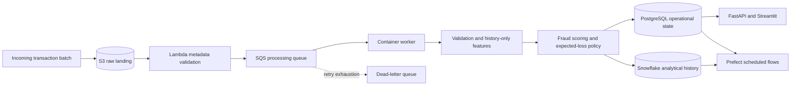

# Architecture

RiskQueue separates event transport, operational application state, and analytical history.

## Event boundary

Lambda performs metadata validation and message creation only. CPU-intensive validation, feature generation, model inference, decision optimization, and persistence run in the container worker.

SQS delivery is at least once. PostgreSQL `processed_events` and deterministic idempotency keys prevent duplicate state. Snowflake `MERGE` prevents duplicate analytical facts. Messages are deleted only after successful processing; Terraform routes repeated failures to an encrypted dead-letter queue.

## Storage responsibilities

**S3** is the versioned raw landing layer. **PostgreSQL** is the OLTP database for processed events, current transaction scores, audit records, analyst queues, and application state. **Snowflake** is the OLAP system for historical scores and daily monitoring aggregates. FastAPI and Streamlit do not require Snowflake for request handling.

## Batch orchestration

Prefect coordinates historical synchronization, monitoring-dataset preparation, and aggregate refreshes. It does not replace SQS for event-level processing.

## Local development

The API, dashboard, deterministic demo, PostgreSQL, and local object-store adapter run without AWS or Snowflake. Cloud clients are dependency-injected in tests, so CI never requires live cloud credentials.
